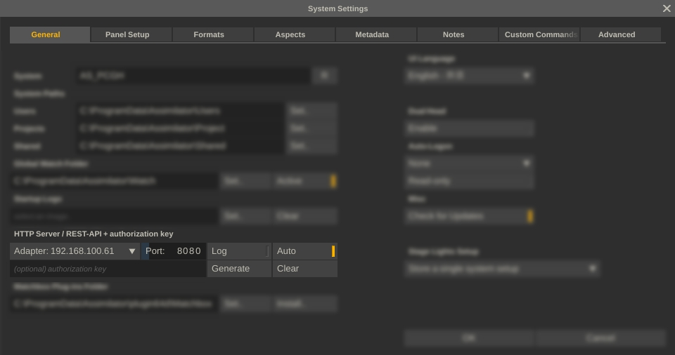
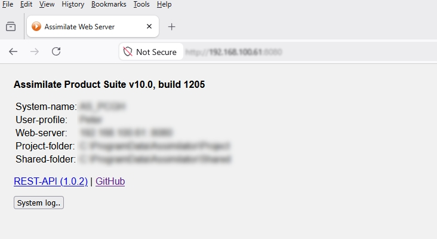
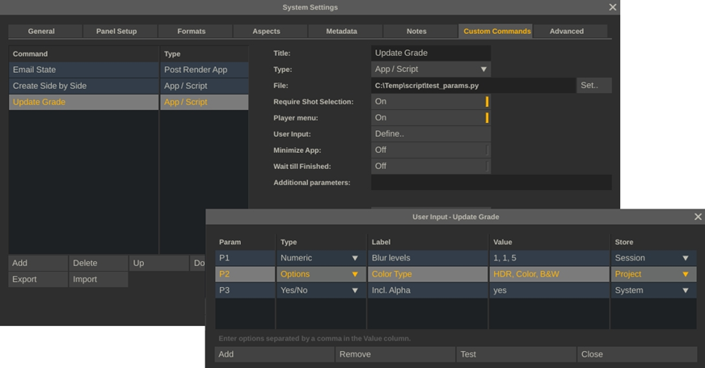

# Assimilate REST API

Official REST API for the **Assimilate Product Suite**

The Assimilate REST API provides programmatic access to data structures and core functionality of the Assimilate Product Suite, including project management, media loading, clip editing, playback control, rendering, and system automation.

> Available from **Assimilate Product Suite v9.9 build 1205** and later.

---

# Table of Contents

- Overview
- Server Configuration
- Security
- Python Wrapper
- OpenAPI Specification
- API Modules
- Project Data Model
- Versioning & Compatibility
- Custom Commands
- Product / License Support
- Other Interfaces
- Support Resources

---

# Overview

The REST API is hosted through the built-in HTTP web server available in supported Assimilate applications.

The web server can be enabled from **System Settings**,



where you can configure:

- Network adapter / interface
- Port number
- Automatic startup when the application launches
- Request logging (useful for debugging)
- Optional access key authentication

Once enabled, the API becomes available locally or across the network.

Example:

```text
http://localhost:8080/
http://127.0.0.1:8080/
```

The default landing page provides:

- System information
- REST API documentation
- Links to this GitHub repository


---

# Security

If an access key is configured, all HTTP requests must include:

```http
Authorization: your-key
```

Requests without a valid key will return:

```http
403 Forbidden
```

---

# Python Wrapper

The REST API supports standard HTTP methods:

- GET
- POST
- PUT
- PATCH
- DELETE

To simplify integration, an official Python wrapper library is available.

Install directly from GitHub:

```bash
pip install git+https://github.com/Assimilate-Inc/Assimilate-REST.git
```

Documentation:

```text
docs/README.md
```

---

# OpenAPI Specification

The Assimilate REST API follows the **OpenAPI Specification (OAS)**.

The repository includes a YAML definition file that can be used to:

- Generate SDKs for other languages
- Build integrations
- Import into Swagger / Postman
- Create custom documentation
- Generate strongly typed clients

---

# API Modules

The REST API is organized into three main modules.

## 1. System

Manage local system settings and installation data.

Examples:

- Name
- Version
- Local paths
- Preferences

## 2. Project

Manage project data and media workflows.

Examples:

- Create projects
- Load media
- Manage groups
- Edit timelines
- Work with trays
- Modify metadata

## 3. Application

Control runtime behavior.

Examples:

- Start / stop playback
- Trigger renders
- Invoke tools
- Application automation

---

# Project Data Model

The **Project** module is the most extensive part of the API. Understanding the internal hierarchy is recommended when building integrations.

## Project

Top-level container for media organization and workflow data.

## Group

A project contains one or more groups used to organize media and timelines.

## Construct / Timeline

In this context, **Construct** and **Timeline** are equivalent.

A construct contains a sequence of media shots arranged for playback or grouped processing.

## Slot

A construct contains one or more slots.

Each slot has a defined duration and may contain:

- no shots
- one shot
- multiple shots

The first shot typically represents the visible timeline shot, while additional shots can act as versions or stacked alternatives.

## Shot

A shot may represent:

- Source media
- Image sequence
- Camera format media
- Live capture
- Effect / plugin node
- Image generator

Most generic shot properties are exposed through the REST API. Some specialized node types may contain custom parameters.

## Grade

A shot may contain color grading data.

Grades may include:

- Primary grade
- Layer grades
- Effect stacks

## Controls

Many shot types expose custom controls or parameters.

Examples:

- Numeric values
- Text values
- Boolean toggles
- Dropdown selections

Some parameter names originate from legacy interfaces and may be highly technical.

## Layer

Layers can be placed on top of any shot.

A layer may contain:

- Position / scale canvas
- Independent grade
- Fill source
- Matte source
- Effects

Layers may also be grouped for linked transforms.

## Input

Effect shots use one or more **Inputs** .

Example:

- Retiming effects
- Video wall or projection node
- Slomo workflows

## Output

Outputs are rendering nodes used to generate files in specific formats.

Outputs are commonly tied to timelines and may be chained together to create multi-delivery pipelines.

## Tray

Projects can contain multiple trays.

Trays are used to organize reusable shots or references for quick access while editing.

---

# Versioning & Compatibility

The REST API has its own version number, mapped to specific Assimilate Product Suite versions and build numbers.

The current version can be queried through system settings endpoints.

Although backward compatibility is a priority, it cannot always be guaranteed.

| Assimilate Product Suite | REST API version |
|---|---|
| v9.9 1206 | 1.0.4 |
| v9.9 1205 | 1.0.3 |
| BETA | 1.0.0 |

## Recommended Best Practices

- Record the API version your integration targets
- Log version mismatches at runtime
- Test scripts after upgrading builds
- Review release notes regularly

---

# Custom Commands

The REST API can be used externally from local or remote systems for automation, rendering, monitoring, and media workflows.

It can also be used internally through **Custom Commands** within the Assimilate Product Suite.

Custom Commands extend the application with user-defined scripts and actions.



A Custom Command can be defined as a button, which will appear in the menus inside the construct or player, or as a system event where the script is invoked on e.g. start / stop the software or open / close a project.

Individual Custom Commands can be saved and loaded as standalone .cc files, making it easy to distribute workflow tools and script installers. When loading a custom command file, script paths are automatically updated.

## User Input Forms

Custom Commands (buttons) can prompt the user for input such as:

- Text input
- Dropdown list
- Numeric input
- Yes / No selection

All values are passed to the underlying script through command-line parameters.

This enables interactive workflow automation directly inside the application.

---

# Product / License Support

Availability depends on product edition, active toolset, and license type.

| Product / License | REST API Support |
|---|---|
| Live FX / SCRATCH | Full support |
| Play Pro Studio | No render options, limited grading support |
| Live Assist / Looks | Currently no API support |
| Trial Licenses | Same as above with request limits per session |

---

# Other Interfaces

The Assimilate Product Suite includes multiple developer interfaces.

## REST API

HTTP interface for:

- Projects
- Media data
- System settings
- Playback
- Rendering

https://github.com/Assimilate-Inc/Assimilate-REST

## SPA

Proprietary plugin SDK for:

- Effects
- Readers
- Writers
- Generators

https://github.com/Assimilate-Inc/Assimilate-SPA

(Note that software also supports the [https://openeffects.org/](OpenFX) plugin standard.)

## Video-IO

Plugin API for output and capture devices.

https://github.com/Assimilate-Inc/Assimilate-Video-IO

---

# Support Resources

## Downloads

https://www.assimilatesupport.com/akb/Downloads.aspx

## Documentation

https://www.assimilatesupport.com/akb/Knowledgebase.aspx

## Licensing / Trials

https://www.assimilateinc.com/

## Community Support

Join the Assimilate Discord community and use the REST API discussion channel.

## Commercial Support

Customers with active support contracts may also use the official email support channel.

---

# License

Refer to repository licensing terms or official Assimilate licensing documentation.
